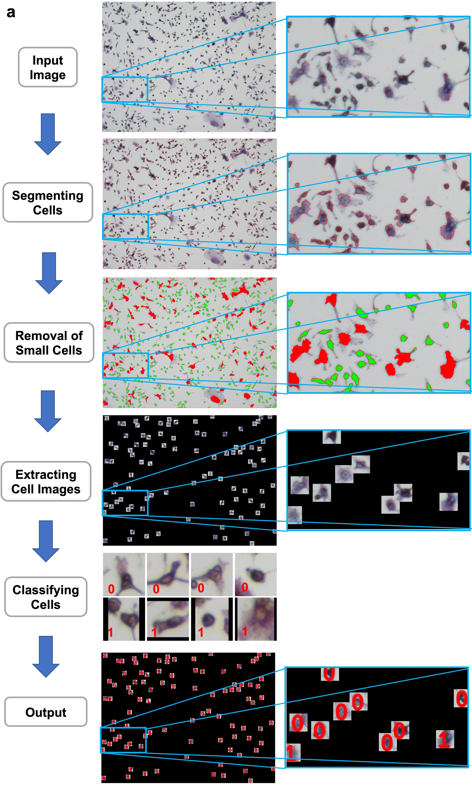
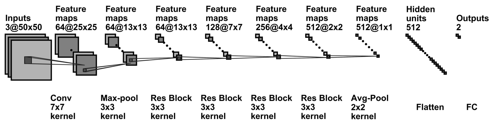

# OC_Finder
<a href="https://github.com/marktext/marktext/releases/latest">
   
   
   
   
   
</a>       


OF_Finder is a computational tool using deep learning for osteoclast segmentation, classification, and counting.

Copyright (C) 2021 Xiao Wang*, Mizuho Kittaka*, Yilin He, Yiwei Zhang, Yasuyoshi Ueki, Daisuke Kihara, and Purdue University. 

License: GPL v3 for academic use. (For commercial use, please contact us for different licensing.)

Contact: Daisuke Kihara (dkihara@purdue.edu)

## Citation:
Xiao Wang*, Mizuho Kittaka*, Yilin He, Yiwei Zhang, Yasuyoshi Ueki & Daisuke Kihara. OC_Finder: A deep learning-based software for osteoclast segmentation, classification, and counting. (2021).

```
@article{wang2021oc_finder,   
  title={OC_Finder: A deep learning-based software for osteoclast segmentation, classification, and counting},   
  author={Xiao Wang*, Mizuho Kittaka*, Yilin He, Yiwei Zhang, Yasuyoshi Ueki, and Daisuke Kihara},    
  journal={},    
  year={2021}    
}   
```

## Training Dataset: [!]()
## Introduction

Osteoclasts are multinucleated cells that exclusively resorb bone matrix proteins and minerals on the bone surface. They differentiate from monocyte/macrophage-lineage cells in the presence of osteoclastogenic cytokines such as receptor activator of nuclear factor-kB ligand (RANKL) and are stained positive for tartrate-resistant acid phosphatase (TRAP). In vitro, osteoclast formation assay is commonly used to assess the capacity of osteoclast precursor cells for differentiating into osteoclasts, where the number of TRAP-positive multinucleated cells are counted as osteoclasts. Osteoclasts are manually identified on cell culture dishes by human eyes, which is a labor-intensive process. Moreover, the manual procedure is not necessarily objective and brings the lack of reproducibility. To accelerate the process and reduce the workload for counting the number of osteoclasts, here we developed OC_Finder, a fully automated system for identifying osteoclasts in microscopic images. OC_Finder consists of segmentation and classification steps. For segmentation, the Otsu’s binarization method was combined with morphological opening and the watershed algorithm. For classification, we used convolutional neural networks. OC_Finder detected osteoclasts differentiated from wild-type and Sh3bp2KI/+ precursor cells at a 95.37% accuracy for segmentation and at a 96.04% accuracy for classification. Furthermore, the number of osteoclasts classified by OC_Finder was at the same accuracy level with manual counting by a human expert. Together, successful development of OC_Finder suggests that deep learning is a useful tool to perform prompt and accurate classification and detection of specific cell types in microscopic images with no bias。

## Overall Protocol
```
1) Segment the input micrscopy image by watershed algorithm;
2) Filter out small cells;
3) Locate the input candidate image for classification;
4) Trained deep learning model make classifications for candidate cell images;
5) Output the detection results.
```
<p align="center">
  
</p> 

### Network Architecture
<p align="center">
  
</p> 

## Pre-required software
Python 3 : https://www.python.org/downloads/    
pdb2vol (for generating simulated maps): https://situs.biomachina.org/fguide.html   
Pymol(for visualization): https://pymol.org/2/        

## Installation  
### 1. [`Install git`](https://git-scm.com/book/en/v2/Getting-Started-Installing-Git) 
### 2. Clone the repository in your computer 
```
git clone https://github.com/kiharalab/OC_Finder && cd OC_Finder
```

### 3. Build dependencies.   
You have two options to install dependency on your computer:
#### 3.1 Install with pip and python(Ver 3.6.9).
##### 3.1.1[`install pip`](https://pip.pypa.io/en/stable/installing/).
##### 3.1.2  Install dependency in command line.
```
pip3 install -r requirement.txt --user
```
If you encounter any errors, you can install each library one by one:
```
pip3 install Pillow==6.2.2
pip3 install numpy==1.18.2
pip3 install pandas==1.0.3
pip3 install opencv-python==4.1.2.30
pip3 install matplotlib==3.2.1
pip3 install torch==1.1.0
```

#### 3.2 Install with anaconda
##### 3.2.1 [`install conda`](https://docs.conda.io/projects/conda/en/latest/user-guide/install/macos.html). 
##### 3.2.2 Install dependency in command line
```
conda create -n OC_Finder python=3.6.9
conda activate OC_Finder
pip install -r requirement.txt 
```
Each time when you want to run my code, simply activate the environment by
```
conda activate OC_Finder
conda deactivate(If you want to exit) 
```

## Usage
```
python3 main.py -h
  -h, --help            show this help message and exit
  -F F                  input microscopy image path
  --mode MODE           0: single image processing; 1: multiple image processing
  --type TYPE           setting type: 0: common setting; 1: including large cells
  --choose CHOOSE       gpu id choose for training, if you use -1 means you do not use gpu
  --class CLASS         number of classes
  --cardinality CARDINALITY
                        ResNeXt cardinality
  --batch_size BATCH_SIZE
                        batch size for training
  -M M                  trained model path of OC_Finder
  --width WIDTH         Width of classification image
  --height HEIGHT       Height of classification image
  --num_workers NUM_WORKERS
                        number of workers for the dataloader
  --resize RESIZE       if we need resize the input microscopy image or not. default: 0(no resizing)
  --resize_height RESIZE_HEIGHT
                        The resized image height used for the segmentation
  --resize_width RESIZE_WIDTH
                        The resized image width used for the segmentation
  --filter_size FILTER_SIZE
                        user can adjust their own filter size to have different segmentation results.
                        default:3
  --threshold THRESHOLD
                        Threshold used to do image segmentation (Suggested 150-210 for big cell cases)
  --remove_pixel REMOVE_PIXEL
                        number of pixels to remove small segmented regions. default: 500
```
### 1 Single Microscopy Image Detection
```
python3 main.py --mode=0 -F=[img_path] -M=[model_path] --choose=[gpu_id] --type=[1 or 0] --filter_size=[filter_size] --threshold=[threshold_level] --resize=[1 or 0] --resize_height=[resize_height] --resize_width=[resize_width] --class=2 --height=50 --width=50 
```
[img_path] is the input microscopy image;   
[model_path] is the trained model path, which we kept our model in "best_model/ema_best.pth.tar";   
[gpu_id] the gpu id used for inference, default:0, for cpu version user, please use -1;
--type is used to specify input image condition, 0 is for common setting, while 1 is for images with large cells;   
--resize resize flag for situation we need to resize for the input image with different resolution. Here 1 denotes resize while 0 forbid resize function;    
--resize_height and --resize_weight specify the resized image height and width, calculated based on new input iamge resolution. The resized image resolution should have the setting that 50 pixels are equivalent to 38um;    
Parameters only for --type=1 (image with large cells):   
--filter_size specifies your filter for segmentation, usually we choose an integer value in range [1,10];    
--threshold specifies your threshold for segmentation, usually we choose an integer value in range [150,210].


#### Example Command
```
python3 main.py --mode=0 -F=example/input/input_example.tif -M=best_model/ema_best.pth.tar --choose=0 --type=0 --class=2 --height=50 --width=50
```
#### Output 
Output are kept in [Predict_Result] directory and the example output is kept in [output](https://github.com/kiharalab/OC_Finder/tree/main/example/output)

### 2 Multiple Microscopy Images Detection
```
python3 main.py --mode=0 -F=[img_dir] -M=[model_path] --choose=[gpu_id] --type=[1 or 0] --filter_size=[filter_size] --threshold=[threshold_level] --resize=[1 or 0] --resize_height=[resize_height] --resize_width=[resize_width] --class=2 --height=50 --width=50 
```
[img_dir] specifies the  directory includes many microscopy images. Other parameters are the same as before.

#### Example Command
```
python3 main.py --mode=1 -F=example/input -M=best_model/ema_best.pth.tar --choose=0 --type=0 --class=2 --height=50 --width=50
```
